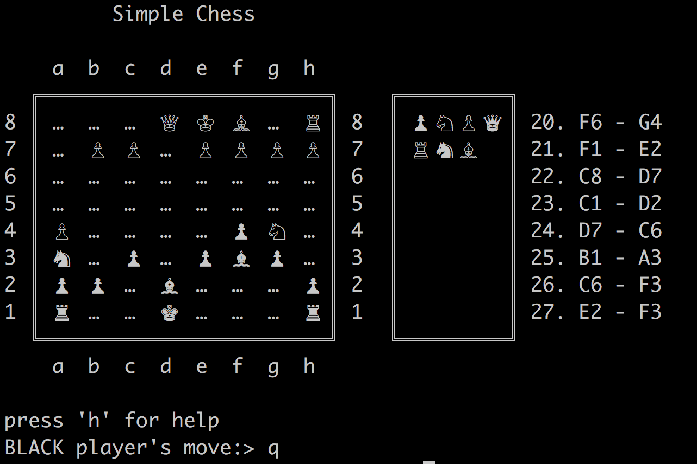

## Simple Chess

### System Requirement

- Java 8

### Installation
- `cd` to the project directory
- run `./gradlew clean build`
- run `java -jar build/libs/command-line-chess-0.0.1-SNAPSHOT.jar`

Remember do not tun the program as gradle task. It will not work as its a commandline program.

SpringBoot used only to leverage dependency management.

### Code flow
This project is build using SpringBoot and implements `ApplicationRunner` to start the program.

`SingleMachineGameController.run` is the method executed by Spring when app starts.

### To Do
- Validator for King movement.
- Movement validator when in Check.
- Display UI when in check.
- Movement validator when in Checkmate.
- Display UI when in Checkmate.